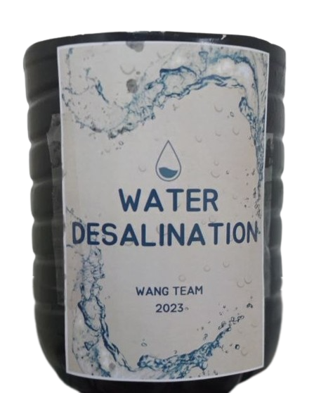

#  Wang Team

> **Water Desalination Project**

## 💧 Overview

Wang Team's Water Desalination Project aims to address global water scarcity through innovative desalination technology. Our project focuses on sustainable methods to convert seawater into clean, usable water for drinking, agriculture, and industrial purposes.

<b>🌟 Key Features</b>

- 🌊 **Innovative Water Desalination** - Converting sea water into clean, usable water
- 🔬 **Research-Driven Approach** - Based on thorough scientific research and testing
- 🌿 **Sustainability Focus** - Designed with environmental impact in mind
- 👥 **Collaborative Development** - Created by a team of dedicated students
- 📱 **Responsive Website** - Modern, mobile-friendly project showcase

## 🔧 Tech Stack

  <table>
    <tr>
      <td align="center" width="96">
        
         HTML5
      </td>
      <td align="center" width="96">
        
         CSS3
      </td>
      <td align="center" width="96">
        
         JavaScript
      </td>
      <td align="center" width="96">
        
         jQuery
      </td>
      <td align="center" width="96">
        
         Bootstrap
      </td>
    </tr>
  </table>

## 📋 Project Description

Water desalination is a crucial process for removing excess salts and minerals from water, making it suitable for human consumption and other uses. Our project addresses the growing global water crisis by developing an efficient and sustainable desalination solution.

Many coastal countries are turning to seawater desalination to meet their water needs due to increasing scarcity of fresh water resources. Our project demonstrates a practical approach to desalination that can be implemented in regions facing water shortages.

## 🚀 Project Features

- **Interactive Single-Page Website**: Smooth scrolling navigation with responsive design
- **Team Showcase**: Highlighting all team members and their contributions
- **Project Documentation**: Detailed explanation of the desalination process and its importance
- **Image Gallery**: Visual documentation of the project development process
- **Animated Elements**: Dynamic content presentation using modern web technologies
- **Mobile-Friendly Design**: Accessible on all device sizes
- **Social Media Integration**: Connect with team members on various platforms

## 👥 Meet Our Team

Our project was developed by a dedicated team of students:

- Mena Emad
- Shady Raied
- Philobateer Maged
- Steven Peter
- Yassa Amir
- Youhanna Ramy
- Peter Sameh
- Mena Medhat

## 🛠️ Development Process

1. **Research Phase**: Extensive research on water desalination methods and technologies
2. **Budget Planning**: Allocation of resources for project development
3. **Material Acquisition**: Purchasing necessary components and materials
4. **Collaborative Construction**: Team-based approach to building the solution
5. **Documentation**: Creating presentation materials and website
6. **Demonstration**: Showcasing the final product and its capabilities

## 📸 Project Gallery

Our project gallery showcases the step-by-step development process, highlighting each team member's contribution to the final product.

## 🔗 View Our Project

- **Website**: [Wang Team Website](https://wang-team.github.io)
- **Project Poster**: Available in the website's Poster section

## 🤝 Contributing

We welcome contributions and suggestions! Feel free to fork this repository and submit pull requests.

## 📝 License

This project is licensed under the MIT License - see the [LICENSE](LICENSE) file for details.

---

  
  
Created by Wang Team - Addressing Global Water Scarcity

 